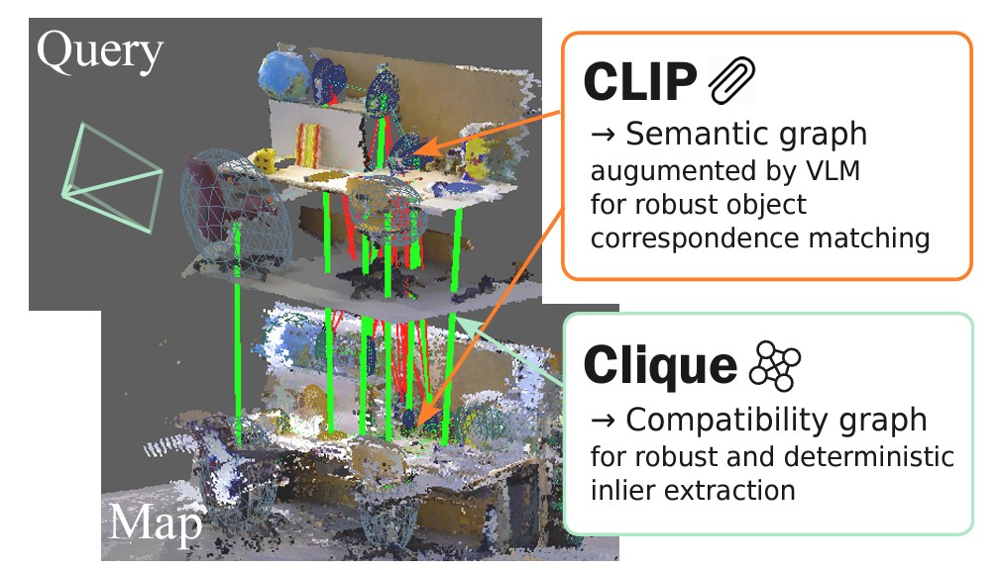
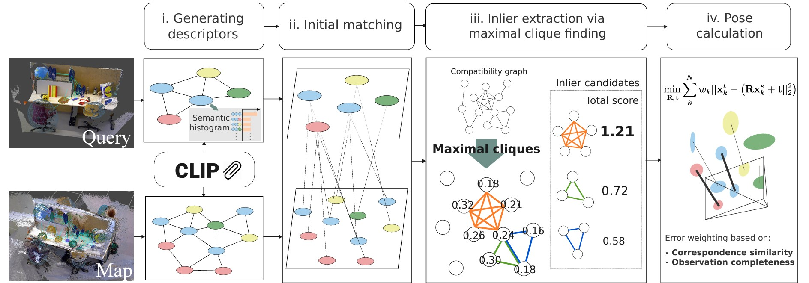

###  Paper Review
Author: Shigemichi Matsuzaki, Kazuhito Tanaka, Kazuhiro Shintani
Paper can be accessed [here](https://arxiv.org/abs/2410.03054)

### Problem or Objective:

- Correspondence generation in localization tasks commonly uses stochastic approaches, i.e., RANSAC, that are prone to producing big errors.
- Some correspondence generation approaches do not consider spatial information.
- We need an approach that can generate correspondences robustly while also considering spatial information.

### Contribution or Key Idea:

- Using both semantic histograms and CLIP semantic descriptors to match the correspondence.
- Utilize a graph-based method to extract the multiple inlier sets.
- Determine correspondences based on the similarity-based ranking.
- Use weighted least squares to calculate the pose.

### Preliminary:

Before we study further about the framework, I think it is better to learn about what **semantic graphs** and **compatibility graphs** are.

- **Semantic graphs:** Describe the spatial and semantic information of the objects.
- **Compatibility graphs:** Encode spatial consistency of object correspondence hypotheses.

Actually, both of them perform almost the same task. But what's the difference?

### Imagine if we have an image below:

*Image by [jemastock on Freepik](https://www.freepik.com/free-vector/urban-buildings-with-cityscape-scenery_4794903.htm#fromView=keyword&page=1&position=1&uuid=84c7302f-1e04-4fcb-9b54-17e480199327)*

In **semantic graphs**, the objects inside the image like car, building, and tree are called nodes.  
While the semantic relationships and spatial relationships are called edges. But what is that?

- **Semantic relationships:** *white car* is behind the *red car*. (Focusing on the red car and white car; objects)
- **Spatial relationships:** The red car is *near* the yellow building. (Focusing on the distance or direction)

---

### For **compatibility graphs**, let's see the image below:

*Image by [Cambridge Landmarks Dataset](https://paperswithcode.com/dataset/cambridge-landmarks)*

Both of the images actually share the same object but in a different view. So, we can say:

- **Nodes:** The hypotheses about correspondences between objects (e.g., between certain points in a building in one image and another building in another image; red and yellow star).
- **Edges:** The compatibility or consistency between hypotheses (e.g., the line that connects the stars).

---

### After understanding the differences between semantic and compatibility graphs, we're ready to dive into the paper's framework!

---

### **Framework:**

To ease understanding, let's note these terms:

- **Object map:** The reference map used as the database.
- **Observed map:** The map observed in the current time.

The proposed framework consists of 4 stages:

1. **Generating object descriptors:**

   There are two ways to retrieve the object descriptors: **CLIP** and **Semantic Histograms**.

   - **CLIP:**  
     - For the object map, we use the text embedding from CLIP.  
     - For the observed map, we use the visual embedding of CLIP.  
     - This approach makes sense since we know the environment when making the database and can use text labels. However, in the observed map, only visual information is available.

   - **Semantic Histograms:**  
     - Both the object map and observed map go through the same calculation process.  
     - In an image, many nodes are captured.  
     - Relationships (edges) between nodes and others are calculated up to a maximum of 3 steps, with thresholds applied.  
     - The frequency of label sequences is normalized to generate the descriptor.

   Once the descriptors from CLIP and Semantic Histogram are generated, their similarity scores are calculated.

2. **Initial matching:**

   The proposed initial matching uses an adaptive matching strategy based on the largest similarity gap.  
   - Scores are sorted in descending order.  
   - Pairs of consecutive scores with the largest gap are identified.  
   - Candidates with similarity scores above the threshold are selected.

   **Example:**

   - **Similarity scores (sorted in descending order):**
     - 4.9: Very similar to Landmark A
     - 4.5: Very similar to Landmark B
     - 3.9: Very similar to Landmark C
     - 2.0: Very similar to Landmark D
     - 1.9: Very similar to Landmark E
     - 1.7: Very similar to Landmark F

   - **Largest gap:**  
     - 4.9 - 4.5 = 0.4  
     - 4.5 - 3.9 = 0.6  
     - **3.9 - 2.0 = 1.9** *(This is the largest gap!)*  
     - Remaining gaps: 0.1, 0.2

   - Threshold: **2.0**  
     - Selected scores: 4.9, 4.5, 3.9

3. **Inlier extraction:**

   The goal of this process is to determine consistent matches (inliers) and reject bad matches (outliers).

   - **Building the compatibility graph:**  
     - **Nodes:** Correspondences (e.g., a match between object and observed map; (m, n)).  
     - **Edges:** Compatibility between nodes, calculated using a rigid digit constant.  
     - Compatibility graph stored in an NxN matrix `C` (1 for compatible, 0 for incompatible).

   - **Extracting compatible sets via maximal clique finding:**  
     - **Clique:** A set of correspondences that are *mutually compatible*.  
     - **Maximal cliques:** Cliques that cannot be extended further.  
     - Steps:  
       1. Treat each clique as hypotheses of inlier correspondences.  
       2. Rank cliques by the sum of similarity scores.  
       3. Sort scores in descending order.  
       4. Select the top `N` cliques.

4. **Pose calculation:**

   Calculate the camera's pose (rotation and orientation) based on refined correspondences.

   Steps:
   - Input the refined correspondences.
   - Define a weighted least-squares problem.
   - Compute weights for each correspondence based on similarity and completeness.
   - Solve the optimization problem to determine the camera's pose.
   - Get the final camera pose.

---

### **Conclusion:**

The proposed method ends here. The results are promising (please check the paper). However, I noticed some ambiguity regarding semantic and compatibility graphs, as they sometimes overlap in steps. This requires further study. Yuhuuu!
