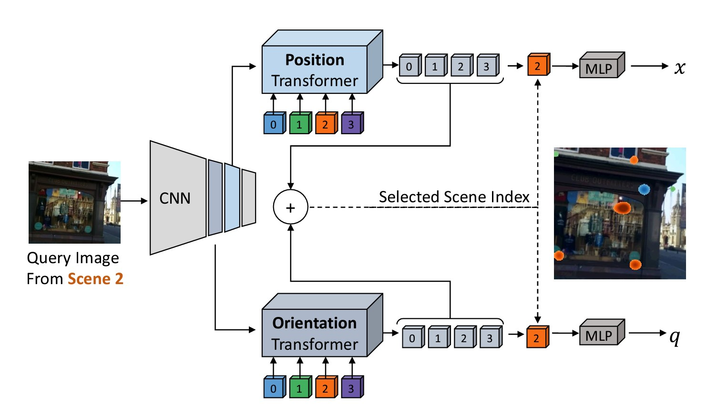
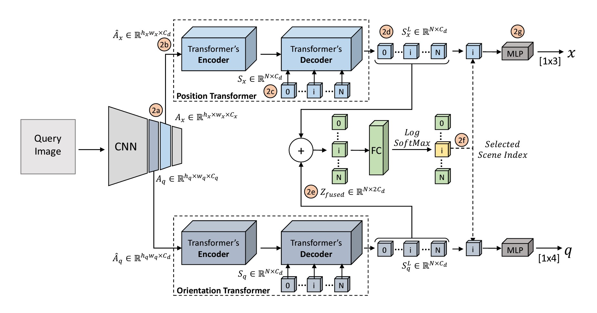

## Learning Multi-Scene Absolute Pose Regression with Transformers
The simple and (I hope) short review for this [**paper**](https://arxiv.org/abs/2103.11468)

## Problem/Objective
- Traditional APR requires separate models for different scenes
- Training separate models requires more time and memory
- Make a model that can handle multiple scenes and train them in a parallel manner

## Contribution/Key Idea
- Leveraging Transformers for multi-scene absolute pose regression
- Demonstrated that self-attention allows aggregation of positional and rotational image cues

## What's the difference between APR and MS-APR?
Absolute Pose Regression (APR):
- Designed to only handle one scene at a time. For example, if you have a house, the APR can only handle a living room, a dining room, or a bedroom at one time.
  We can't have a whole house part at one time.
- It commonly employs a CNN backbone that processes the input image to output a global feature vector. We pass this global feature vector to the MLP head to regress the camera's pose 

Multi-scene Absolute Pose Regression (MS-APR):
- Designed to use one model to understand and predict the camera pose across various scenes.
- Like the APR, it uses CNN to extract global feature vectors. The head slightly differs from APR, there are various techniques to estimate the camera pose from the various scenes.
  It can use the MLP or transformer-based.

## Framework
The proposed framework is shown in the image above. For simplicity, we will divide the explanation into stages. 

**Feature Backbone**
- Pass the image into the CNN backbone. This step extracts the features of the images.
- There will be 2 results of the CNN. The activation map for position and orientation, Ax and Aq.
  The Ax and Aq have different resolutions (see Figure 2a).
- Before passing to the transformer, we need to prepare the activation map to match the transformer's input requirements. How?
  - Applied a 1&times;1 convolution to reduce dimensionality, Ca -> Cd
  - Flatten the 3D tensor to 2D: Ha &middot; Wa &times; Ca -> Ha &times; Wa &times; Ca
  - Here is the problem: when we flatten the tensor, there is a probability we can lose the spatial relationship. Thus, **positional encoding** is added to the sequence.
  - Make the positional embedding (X and Y):
    - Consider Wa as the X position with j-th grid; Ha as the Y position with i-th grid
    - The set of positions in X will be called Eu, with the dimensionality Ca/2
    - The set of positions in Y will be called Ev, with the dimensionality Ca/2
    - If we concatenate Eu and Ev, we can obtain the position data for every grid <i>E</i>i,jpos = [<i>E</i>ju; <i>E</i>iv]. Even if we flatten it, we will know the position of each grid.

**Transformers: Encoder**
- The input to the transformer is the flattened activation map plus positional encoding -> Z = A_flatten + E.
- There are two encoders: one for position and one for orientation.
- The key components of the encoder are the Multi-Head Attention (MHA) and the MLP (Multi-Layer Perceptron).
- First, normalize the input and pass it into the MHA. The result from the MHA is then added back to the initial input to produce the final result. (Refer to Eq 3 in the paper).

  Zl' = MHA(LN(Zl-1)) + Zl-1 
- The final result of the MHA is then normalized and passed into the MLP. The result from the MLP is then added back to the initial input of this stage. (Refer to Eq 4 in the paper).

  Zl = MHA(LN(Zl'-1)) + Zl'-1 
- Finally, perform the last linear transformation. (Refer to Eq 5 in the paper).

  ZL = LN(Zl-1) 

**Transformers: Decoder**
- Please remember that **we already know** how many scenes are in the dataset. We will use this as the index information in the decoder process.
- We take the result from the encoder (both position and orientation) to another attention network (similar to Eq 3 and 4).
- The result of the decoder, SL, for both position and orientation, will be concatenated later and passed into an FC (Fully Connected) layer to select the detected scenes.
- The detected scene (index) is then chosen.

**Position and Orientation Estimation**
- The selected index is communicated to the result of the transformer for both position and orientation.
- The result from the transformer decoder, corresponding to the selected index, is then regressed using an MLP to obtain the predicted pose.

## Multi-Scene Camera Pose Loss
- Position Loss, Euclidean distance -> <i>Lx = ||x0 - x||2</i>
- Orientation Loss -> <i>Lq = ||(q0 - q) / ||q|| ||2</i>
- Combined Camera Pose Loss (Lp) -> <i>Lp = Lx exp(-sx) + sx + Lq exp(-sq) + sq</i> 
- Overall Multi-Scene Loss -> <i>Lmulti-scene = Lp + NLL(s, s0)</i>

## Conclusion
This multi-scene pose estimation using transformers appears to be a legitimate approach. It would be highly effective if we could apply it to a very large dataset.
